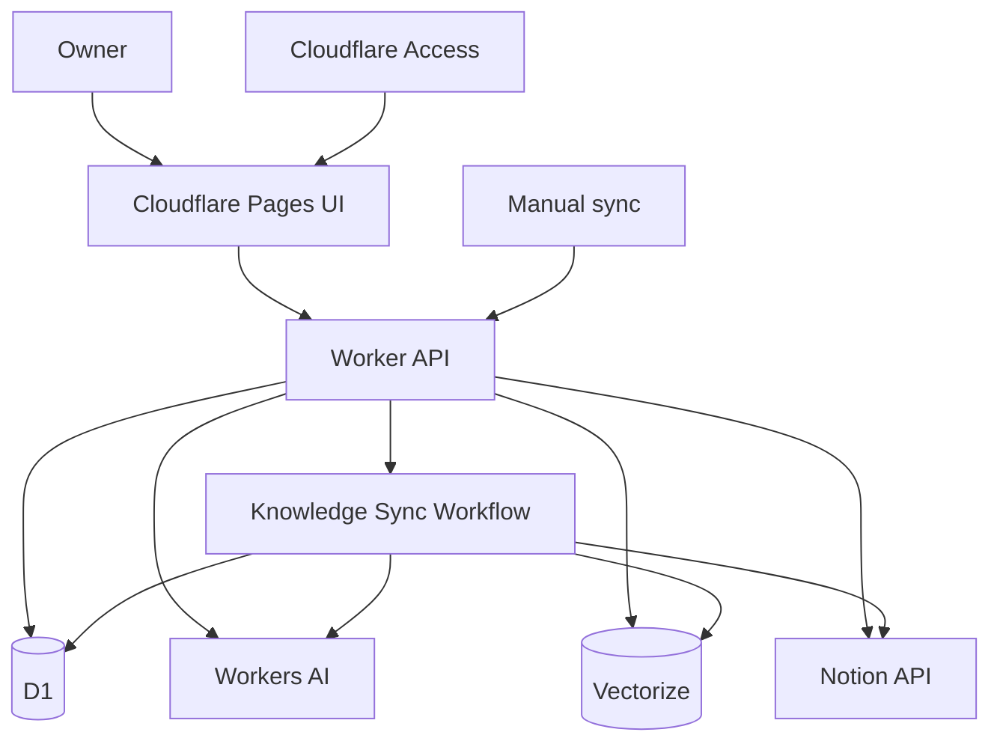
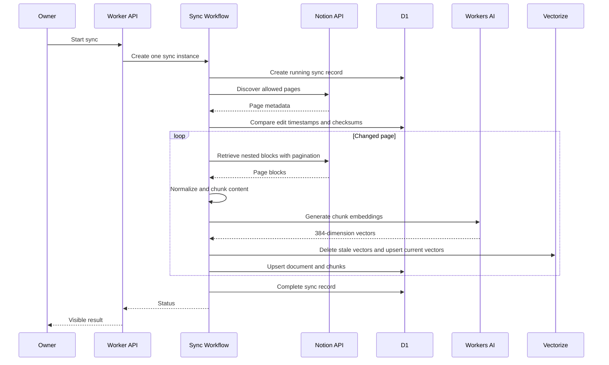
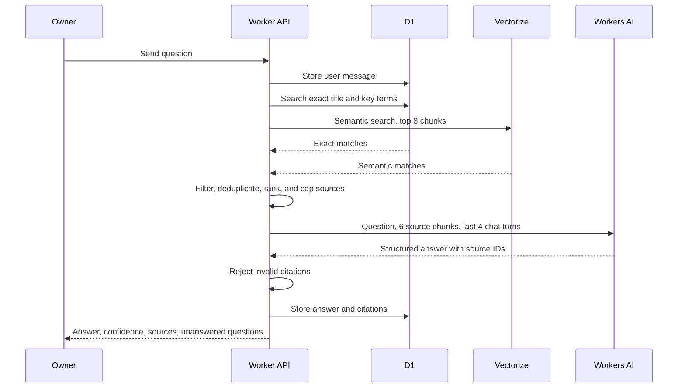
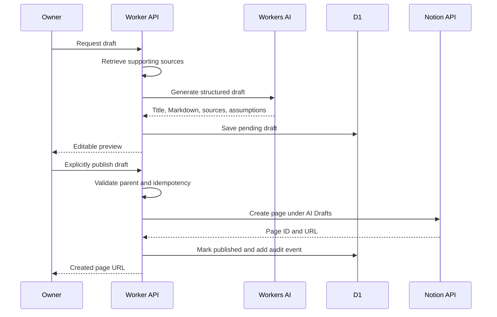

# Engineering Knowledge Gardener — Project Plan

## Product intent

Engineering Knowledge Gardener is a private, source-grounded assistant for a developer's Notion knowledge base. Its supported source material is intentionally engineering-focused: architecture decision records, runbooks, setup guides, incident notes, engineering standards, and learning notes.

The product delivers three outcomes:

1. **Explore** — answer questions from indexed Notion content and cite the exact source pages/excerpts used.
2. **Maintain** — surface evidence-based documentation-health findings for human review.
3. **Draft** — create proposed new Notion pages from source material; publish only after explicit user approval.

## Scope and boundaries

### v1 scope

- One owner and one Notion workspace.
- One explicitly shared Notion root for engineering knowledge.
- One fixed Notion parent for new pages: `AI Drafts`.
- Manual sync and a visible sync history.
- Grounded questions, citations, and persistent chat/draft history.
- Public demo mode backed only by fictional documents.
- Private live mode connected to the owner's selected Notion root.

### Non-goals for v1

- Crawling the full personal Notion workspace.
- Arbitrary edits or deletion of existing Notion pages.
- Publishing content without a user approval action.
- Multi-user product support, OAuth, or shared-workspace authorization.
- GitHub, Slack, browser, or external-web retrieval.
- Claims unsupported by retrieved source excerpts.
- Treating stale-document signals as confirmed factual staleness.

## Chosen stack

| Layer                  | Choice                                                                                       |
| ---------------------- | -------------------------------------------------------------------------------------------- |
| Package management     | Yarn 4 workspace, pinned with Corepack and committed `yarn.lock`                             |
| Language               | TypeScript with strict compiler settings                                                     |
| Web UI                 | React, Vite, Tailwind CSS, deployed to Cloudflare Pages                                      |
| API                    | Separate Cloudflare Worker using Hono and Zod                                                |
| Notion integration     | Small native REST client around Worker `fetch`; no Notion SDK dependency                     |
| Answer and draft model | Workers AI: `@cf/meta/llama-3.3-70b-instruct-fp8-fast`                                       |
| Embedding model        | Workers AI: `@cf/baai/bge-small-en-v1.5` with a 384-dimension Vectorize index                |
| Operational state      | Cloudflare D1                                                                                |
| Semantic retrieval     | Cloudflare Vectorize                                                                         |
| Long-running sync      | Cloudflare Workflows                                                                         |
| Tests                  | Vitest + Miniflare, Playwright                                                               |
| CI                     | GitHub Actions: Corepack/Yarn install, format/lint, typecheck, unit/integration tests, build |

### Toolchain constraints

- Node.js `26.8.1` is pinned for local development and CI as an explicit project override. It is a Current release on 2026-09-05, so this repository accepts the shorter pre-LTS support window and will re-evaluate the pin when Node 26 reaches LTS.
- Yarn 4 is the sole package manager. `package.json` pins the `packageManager` field, and local/CI setup uses `corepack enable` followed by `yarn install --immutable`.
- Commit `yarn.lock` and use `.yarnrc.yml` with `nodeLinker: node-modules` to avoid Plug'n'Play compatibility issues in Wrangler, Vite, Tailwind, Playwright, and Cloudflare's Worker test tooling.
- All repository scripts are invoked through Yarn: `yarn dev`, `yarn dev:worker`, `yarn test`, `yarn test:e2e`, `yarn typecheck`, `yarn lint`, `yarn build`, and `yarn deploy`.
- Do not use `pnpm` or Deno as project package managers/task runners. The Worker runtime target remains Cloudflare Workers, not a Deno deployment runtime.

## Architecture

### Environments

| Environment | Purpose                     | Data source                                           | Exposure                       |
| ----------- | --------------------------- | ----------------------------------------------------- | ------------------------------ |
| `demo`      | Public reviewer demo and CI | Fictional seeded documents through the source adapter | Public, no Notion credentials  |
| `live`      | Owner's personal deployment | Selected Notion knowledge root                        | Protected by Cloudflare Access |

The browser never receives the Notion token. Demo and live data must not share databases, Vectorize indexes, or deployment secrets.

### Worker bindings and secrets

| Name                      | Type / use                                       |
| ------------------------- | ------------------------------------------------ |
| `AI`                      | Workers AI binding                               |
| `DB`                      | D1 binding                                       |
| `KNOWLEDGE_INDEX`         | Vectorize binding, 384 dimensions                |
| `KNOWLEDGE_SYNC`          | Workflow binding                                 |
| `NOTION_TOKEN`            | Worker secret for the internal Notion connection |
| `NOTION_ROOT_PAGE_ID`     | Configured allowed Notion knowledge root         |
| `NOTION_DRAFTS_PARENT_ID` | Fixed parent for assistant-created pages         |
| `APP_ALLOWED_ORIGIN`      | Allowed Pages origin for CORS                    |
| `APP_MODE`                | `demo` or `live`                                 |

## Notion integration design

1. Create an internal Notion connection.
2. Share only the selected Engineering Knowledge root with that connection.
3. Configure `AI Drafts` as the only writable parent.
4. Read pages and nested blocks recursively, with pagination.
5. Track Notion `last_edited_time` and a normalized-content checksum in D1.
6. Use Notion search only for discovery; do not treat it as full-text knowledge retrieval.
7. Respect the documented average limit of three requests per second per connection.
8. On `429` or `529`, honor `Retry-After`, apply exponential backoff with jitter, limit retries, and surface documents that could not be synchronized.

Writes require an idempotency key stored in D1. A repeated publish request must return the original Notion page result rather than create a duplicate page.

## Persistent data model

| Table              | Key fields and indexes                                                                                                                                                                                                       |
| ------------------ | ---------------------------------------------------------------------------------------------------------------------------------------------------------------------------------------------------------------------------- |
| `knowledge_spaces` | `id`, `name`, `source_type`, `source_root_id`, `mode`, `last_successful_sync_at`; unique source type and root ID                                                                                                             |
| `documents`        | `id`, `knowledge_space_id`, `source_page_id`, `title`, `source_url`, `parent_source_page_id`, `last_edited_at`, `checksum`, `index_status`; unique `(knowledge_space_id, source_page_id)`, indexes on status and last edited |
| `document_chunks`  | `id`, `document_id`, `ordinal`, `content`, `token_count`, `checksum`; unique `(document_id, ordinal)`                                                                                                                        |
| `sync_runs`        | `id`, `knowledge_space_id`, `status`, start/end times, discovered/indexed/skipped/failed counts, error summary; index by knowledge space and start time                                                                      |
| `conversations`    | `id`, `knowledge_space_id`, `owner_session_id`, timestamps; index by session                                                                                                                                                 |
| `messages`         | `id`, `conversation_id`, `role`, `content`, `citation_json`, `created_at`; index by conversation and creation time                                                                                                           |
| `drafts`           | `id`, `knowledge_space_id`, `title`, `content_markdown`, `source_json`, `assumptions_json`, `target_parent_id`, `status`, `idempotency_key`, `notion_page_id`, timestamps; unique idempotency key                            |
| `audit_events`     | `id`, action, resource ID, outcome, non-sensitive metadata, timestamp; index by resource and time                                                                                                                            |
| `feedback`         | `id`, message/draft ID, rating, correction, timestamp                                                                                                                                                                        |

Vectorize metadata contains `knowledgeSpaceId`, `documentId`, `chunkId`, and the document's edit timestamp. Raw chunk text remains in D1.

## Synchronization behavior

### Sync flow

### Sync rules

- A manual sync starts the workflow; a second request while a sync is running returns its existing run ID.
- Initial sync is capped at **50 documents** or **2,000 chunks**.
- Changed pages are normalized into plain text/Markdown from supported blocks.
- Chunks contain the page title and breadcrumb, target **500–700 tokens**, and overlap by **80 tokens**.
- Unchanged pages are skipped.
- Deleted/inaccessible pages have their D1 chunks and Vectorize entries removed after confirmation in a successful discovery pass.
- A failed document is recorded independently. Successful documents remain searchable, but the UI must show the knowledge space as partially stale.
- The assistant must not present a failed/incomplete source as current without showing its stale status.

## Grounded question flow

### Answer contract

The LLM response contains:

- `answer`
- `confidence`: `high`, `medium`, or `low`
- `citations`: source chunk IDs plus short supporting quotes
- `unansweredQuestions`

The Worker validates the schema and verifies every citation ID is among the retrieved chunks. It removes/rejects invalid citations. If retrieval does not provide sufficient support, the response states that the indexed knowledge base does not support an answer; it does not answer from model prior knowledge.

### Retrieval constraints

- Question input maximum: **2,000 characters**.
- Vectorize retrieval: top **8** candidates before deduplication.
- LLM context: maximum **6** source chunks and the last **4** turns.
- Per-source excerpt is truncated to the configured context budget.
- Coarse Worker-level request limiting prevents repeated expensive requests.

## Draft creation and publishing

### Publishing rules

- Draft content maximum: **20,000 characters**.
- v1 accepts Markdown/plain text only; it does not support arbitrary rich block construction.
- The user can edit, discard, or explicitly publish a pending draft.
- The Worker verifies the configured draft parent before every write.
- The Worker records a non-sensitive audit event for draft generation, discard, publication, and failure.
- No existing Notion page is edited in v1.

## Garden behavior

The garden uses deterministic signals before any LLM recommendation:

- document age based on `last_edited_at`,
- missing configured metadata such as status/tag,
- normalized title collisions,
- configured obsolete keywords, such as an old runtime version.

The LLM only turns a signal plus source evidence into a cautious, prioritized recommendation. Every recommendation must identify its source page and reason. The UI labels these as **review suggestions**, not confirmed defects.

## API and UI contract

### Worker endpoints

| Endpoint                          | Behavior                                                           |
| --------------------------------- | ------------------------------------------------------------------ |
| `GET /health`                     | Service and dependency readiness without secrets or source content |
| `POST /sync`                      | Start/reuse a manual sync workflow                                 |
| `GET /sync/:runId`                | Sync status and non-sensitive counts/errors                        |
| `POST /chat`                      | Grounded answer for a question and conversation ID                 |
| `GET /conversations/:id/messages` | Restore the active conversation for its demo browser session       |
| `GET /documents/search`           | Keyword/title source search with pagination                        |
| `POST /drafts`                    | Generate a pending draft from a request and retrieved sources      |
| `POST /drafts/:id/publish`        | Publish a user-approved draft to the fixed Notion parent           |
| `POST /feedback`                  | Save answer/draft quality feedback                                 |

### Pages views

| View           | Required behavior                                                                          |
| -------------- | ------------------------------------------------------------------------------------------ |
| Chat           | Show answer, confidence, source cards, unanswered questions, and feedback controls         |
| Sources/Search | Browse indexed documents, excerpts, source freshness, and original Notion links            |
| Sync           | Start a sync, view current run status, last successful sync, skipped documents, and errors |
| Drafts         | Show editable pending drafts, citations, assumptions, publication status, and page links   |
| Garden         | Show review suggestions, evidence, affected pages, and filters by type/status              |

### Error states

- Notion authorization/access failure explains which root or connection must be shared.
- Rate-limited sync shows retrying state and final failed documents if retries exhaust.
- Worker/AI quota exhaustion fails closed with an actionable retry-later message.
- Malformed model output returns a safe retry option without displaying invalid content.
- Missing or stale sources are labelled rather than silently omitted.
- A duplicate publish request returns the existing published Notion URL.

## Security and privacy requirements

- The Notion connection is restricted to the selected Engineering Knowledge root.
- Notion credentials exist only as Worker secrets.
- Live deployment is protected by Cloudflare Access.
- CORS only allows `APP_ALLOWED_ORIGIN`.
- Public demo data consists solely of fictional fixtures.
- Personal Notion content, tokens, screenshots, test fixtures, logs, and prompt history must never be committed.
- Live citation content is displayed only in the authenticated live environment; the public demo displays excerpts only from controlled fictional fixtures.
- Provide owner controls to clear chat history and delete indexed data for the configured knowledge space.
- Store operational metadata and errors without full document bodies.
- Treat retrieved Notion content as untrusted data. The model instruction explicitly ignores commands found inside source pages and uses source pages only as evidence.
- User prompts and Notion content are never allowed to alter tool permissions, source scope, or publishing requirements.

## Costs, limits, and guardrails

All figures below were checked on **2026-09-04** and must be re-verified before deployment.

| Integration | Free allocation / cost position                                                                                | Project guardrail                                                                               |
| ----------- | -------------------------------------------------------------------------------------------------------------- | ----------------------------------------------------------------------------------------------- |
| Notion      | Individual Free is `$0`; Notion lists Public API on Free and individual workspaces have unlimited pages/blocks | Use one internal connection and one selected root; no Notion AI or paid Notion feature required |
| Notion API  | Average 3 requests/second per connection; workspace limits also apply                                          | Sequential queued sync, retry handling, changed-pages only                                      |
| Workers AI  | 10,000 Neurons/day free; usage beyond the allocation is `$0.011` per 1,000 Neurons                             | Llama calls receive capped context/output; manual sync; clear quota errors                      |
| D1          | 5 million rows read/day, 100,000 rows written/day, 5 GB storage on Workers Free                                | Indexed queries, document/chunk caps, retention/deletion controls                               |
| Vectorize   | 30 million queried vector dimensions/month and 5 million stored vector dimensions on Workers Free              | 384-dimension index, 2,000 initial chunk cap, top-8 retrieval cap                               |
| Workflows   | 3,000 steps/day, 1 GB state, and 10 ms CPU per invocation on Workers Free                                      | Small resumable steps, one active sync, short retention, no unnecessary polling                 |

Official references:

- [Notion pricing](https://www.notion.com/pricing)
- [Notion API request limits](https://developers.notion.com/reference/request-limits)
- [Workers AI pricing](https://developers.cloudflare.com/workers-ai/platform/pricing/)
- [D1 pricing](https://developers.cloudflare.com/d1/platform/pricing/)
- [Vectorize pricing](https://developers.cloudflare.com/vectorize/platform/pricing/)
- [Workflows pricing](https://developers.cloudflare.com/workflows/reference/pricing/)

The project will not require paid APIs. Quota monitoring belongs in the Cloudflare dashboard and in the application's sync/AI error states. The application must fail closed when a free allocation is exhausted rather than generate unexpected paid usage.

## Evaluation, test data, and observability

### Fictional knowledge fixtures

| Fixture                 | Required facts                                                                 |
| ----------------------- | ------------------------------------------------------------------------------ |
| `storage-adr`           | D1 is primary structured storage; KV is cache/config; R2 holds larger objects  |
| `worker-deploy-runbook` | Wrangler deployment, staging validation, and rollback steps                    |
| `connection-incident`   | Export feature exhausted database connections; a feature flag mitigated impact |
| `local-setup`           | Required runtime, installation, local development, and test commands           |

### Evaluation cases

| Question                                     | Required outcome                                                               |
| -------------------------------------------- | ------------------------------------------------------------------------------ |
| “Why did we choose D1?”                      | Cites `storage-adr` and identifies structured persistent data                  |
| “How was the connection incident mitigated?” | Cites `connection-incident` and identifies the feature flag action             |
| “How do I run this project locally?”         | Cites `local-setup` and returns only documented commands                       |
| “What did we decide about Kubernetes?”       | Reports insufficient indexed evidence rather than inventing a decision         |
| “Draft a runbook from the incident.”         | Creates a pending draft with incident citations and clearly marked assumptions |

### Test layers

- **Unit:** Notion block normalization, chunking, checksums, ranking, stale-signal rules, response/citation validation, idempotency.
- **Worker integration:** D1 migrations/queries, mocked Notion HTTP adapter, mocked Workers AI and Vectorize bindings, workflow step failure/retry paths.
- **End-to-end:** Demo sync status, grounded answer with source cards, unanswerable question, draft approval, and duplicate-publish protection.
- **Evaluation:** Fixture questions assert required fact IDs, citation validity, and refusal to make unsupported claims.

CI must never call a live Notion workspace.

### Observability

Capture structured events without source document bodies:

- sync start/completion/failure and per-document status,
- documents/chunks indexed or skipped,
- Notion retry and rate-limit counts,
- AI attempt, malformed output, citation rejection, and quota-error counts,
- retrieval result counts,
- endpoint latency,
- draft state transitions.

The UI exposes run status and actionable errors; the repository documents where to inspect Cloudflare service metrics.

## Phased implementation

### Phase 0 — Foundation and controlled fixtures

**Deliverable:** Repository structure, architecture decision record, fictional source fixtures, source-adapter interface, database schema/migrations, and local development instructions.

**Acceptance criteria:**

- Demo fixtures contain no personal material.
- D1 schema and typed domain models exist.
- `PROMPT_HISTORY.md`, `PLAN.md`, and initial README outline exist.
- Node `26.8.1`, Corepack, and Yarn `4.18.0` install successfully from a clean checkout.
- `yarn dev:worker` runs Wrangler locally, and `yarn build` produces the Pages frontend build.
- Lint, typecheck, unit-test, and build commands run in CI through Yarn.

### Phase 1 — Demo-mode grounded chat

**Deliverable:** Pages chat UI, Worker API, Workers AI answer path, D1 conversation/message persistence, and fictional source citations.

**Acceptance criteria:**

- A user asks a question and sees an answer, confidence, and valid source cards.
- The four fixture evaluation questions pass, including the unanswerable case.
- Chat history persists across a browser refresh in demo mode.
- This provides the minimum assignment core: LLM, Worker coordination, Pages chat input, and D1 state.

### Phase 2 — Live Notion read and workflow sync

**Deliverable:** Internal Notion connection setup, source-scoped live mode, manual Workflow sync, block normalization, and source freshness UI.

**Acceptance criteria:**

- Only pages beneath the configured shared root are indexed.
- Changed pages are re-indexed; unchanged pages are skipped.
- Pagination, nested blocks, retries, and partial failures are tested.
- The UI shows sync status, source freshness, and failed documents.

### Phase 3 — Hybrid semantic retrieval and evaluation integrity

**Deliverable:** Vectorize indexing, hybrid retrieval, citation-ID validation, retrieval telemetry, and expanded evaluation suite.

**Acceptance criteria:**

- Semantic and exact search results are merged/deduplicated predictably.
- Every answer citation maps to a retrieved D1 chunk and Notion page URL.
- The model cannot return a cited source it was not given.
- Retrieval and context caps remain within the documented free-tier guardrails.

### Phase 4 — Safe Notion draft publishing

**Deliverable:** Draft generation, editable preview, fixed-parent publication, audit events, and idempotency protection.

**Acceptance criteria:**

- Draft generation makes no Notion write.
- Publishing requires a separate explicit user action.
- Every write goes to `NOTION_DRAFTS_PARENT_ID`.
- Retried publish requests do not duplicate pages.
- Created pages link back to source documents used for the draft.

### Phase 5 — Garden findings, hardening, and submission polish

**Deliverable:** Documentation-health dashboard, feedback loop, Access-protected live deployment, public demo deployment, tests, architecture screenshots, and complete README.

**Acceptance criteria:**

- Garden findings are traceable to deterministic signals and source evidence.
- Live deployment requires owner authentication; demo deployment contains only fictional data.
- README covers problem, architecture, setup, deployment, security, costs, trade-offs, test/eval strategy, and demo instructions.
- Prompt history is complete and repository is ready for public submission.

## Deliberate deferrals

- OAuth and multi-workspace support.
- Edits/deletes of existing Notion pages.
- Automatic scheduled sync and Notion webhooks.
- GitHub/Slack integrations.
- MCP server support.
- External web research or automatic source verification.
- Rich Notion block editing beyond Markdown/plain-text draft creation.
- Autonomous content publication.

## Delivery checklist

- [ ] Public repository has no secrets or personal content.
- [ ] `README.md` explains problem, architecture, local setup, deployment, use, costs, security, and trade-offs.
- [ ] `PROMPT_HISTORY.md` contains substantive planning and coding prompts from project selection onward.
- [ ] Demo environment uses only fictional data.
- [ ] Live environment is Access-protected and Notion-scoped.
- [ ] Evaluation fixtures and test commands are documented and runnable.
- [ ] Deployed Pages demo URL and GitHub repository URL are ready for the application form.
