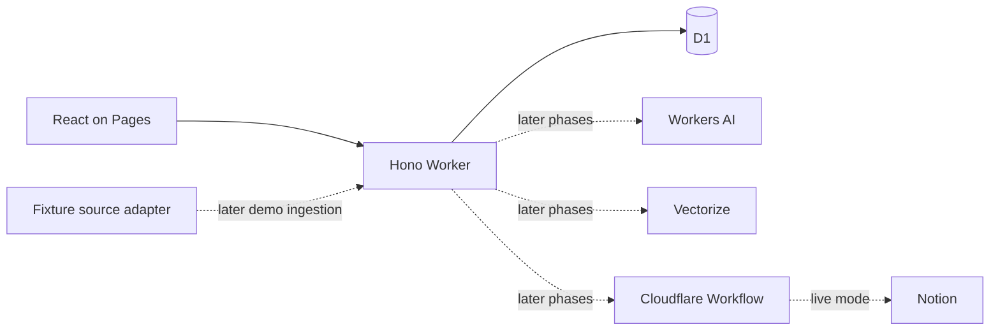

# Engineering Knowledge Gardener

Engineering Knowledge Gardener is a private, source-grounded assistant for engineering documentation. It is designed to answer questions with citations, identify reviewable documentation-health signals, and prepare drafts that are published only after explicit approval.

The repository currently implements **Phase 0**: the local application foundation, complete D1 schema, source-adapter contract, and controlled fictional fixtures. It does not yet call an LLM, connect to Notion, synchronize documents, or publish content.

## Architecture



The Pages frontend and Worker API are separate deployable applications. Shared domain schemas and source contracts keep their interfaces explicit. Demo sources use the same adapter shape planned for Notion, while source-neutral identifiers avoid pretending fictional pages are Notion pages.

See [ADR 0001](docs/adr/0001-foundation-architecture.md) and [the project plan](PLAN.md) for the decisions and phased roadmap.

## Repository layout

```text
apps/web                 React, Vite, and Tailwind Pages application
apps/worker              Hono Worker, D1 migration, repositories, Worker tests
packages/domain          Zod schemas and inferred domain types
packages/source          Source-adapter interface and typed source errors
packages/fixtures        Fictional Markdown sources and demo adapter
docs/adr                 Architecture decision records
plans                    Approved implementation plans
```

## Prerequisites

- Node.js `26.8.1`
- Corepack
- Yarn `4.18.0`, selected from the root `packageManager` field

Node 26 was still a Current release when selected. This project intentionally pins it at the user's request and records that trade-off in the ADR.

## Local development

From a clean checkout:

```sh
nvm use
node --version
corepack enable
yarn --version
yarn install --immutable
yarn db:migrate:local
yarn dev
```

The version commands should print `v26.8.1` and `4.18.0`. The Pages shell runs at `http://localhost:5173`; the Worker runs at `http://localhost:8787`. The UI requests `GET /health` and shows whether the local D1 binding is ready.

To run either process separately:

```sh
yarn dev:web
yarn dev:worker
```

Copy `apps/web/.env.example` to `apps/web/.env.local` only if the API origin differs from the default. Local Worker mode and allowed origin are non-secret variables in `apps/worker/wrangler.jsonc`.

## Quality checks

```sh
yarn format:check
yarn lint
yarn typecheck
yarn test
yarn build
```

`yarn test` validates domain contracts, fixture privacy and pagination, the real D1 migration and constraints, repository mapping, CORS, and the health endpoint. Tests use isolated local Cloudflare runtime storage and never contact Notion.

`yarn build` creates the Pages output at `apps/web/dist` and performs a dry-run Worker bundle at `apps/worker/dist`.

## Data and fixtures

Phase 0 includes four reviewer-readable, fictional documents:

- A storage architecture decision
- A Worker deployment runbook
- A database-connection incident report
- A local setup guide

Their metadata is deterministic and validated at runtime. Synthetic `demo://` URLs clearly distinguish them from live sources. Personal Notion content, credentials, screenshots, and production identifiers must never be added to fixtures, logs, tests, prompt history, or commits.

## Configuration and future bindings

Phase 0 activates only:

| Name                 | Purpose                              |
| -------------------- | ------------------------------------ |
| `DB`                 | Local D1 binding                     |
| `APP_MODE`           | `demo` for the Phase 0 runtime       |
| `APP_ALLOWED_ORIGIN` | Exact browser origin allowed by CORS |
| `VITE_API_BASE_URL`  | Browser-visible Worker origin        |

Later phases will provision Workers AI (`AI`), Vectorize (`KNOWLEDGE_INDEX`), Workflows (`KNOWLEDGE_SYNC`), and live-only Notion configuration. Tokens will be Worker secrets and will never be exposed to the browser.

## Deployment status

Production resources and deployment commands are deliberately unavailable in Phase 0. Future phases will create separate public demo and Access-protected live environments with isolated databases, indexes, and secrets.

## Trade-offs

- Separate Pages and Worker applications require two local processes but preserve a clear trust boundary.
- Raw D1 SQL avoids ORM overhead and generated migrations but requires explicit row mappers and constraint tests.
- The complete v1 schema reduces later foundational churn, while accepting that additive migrations may still be needed.
- Markdown fixtures are easy to review; a small bundling rule is required to make them Worker modules.
- Node 26.8.1 is newer than the LTS line available on the decision date, so the pin must be revisited as the release matures.

## Roadmap

1. **Foundation and fixtures** — current phase.
2. **Demo grounded chat** — Workers AI, citations, and persistent conversations.
3. **Live Notion synchronization** — scoped reads and a resumable Workflow.
4. **Hybrid retrieval** — Vectorize, exact search, and citation validation.
5. **Safe draft publishing** — editable drafts, approval, fixed parent, and idempotency.
6. **Garden and submission polish** — review suggestions, feedback, hardening, and deployments.
