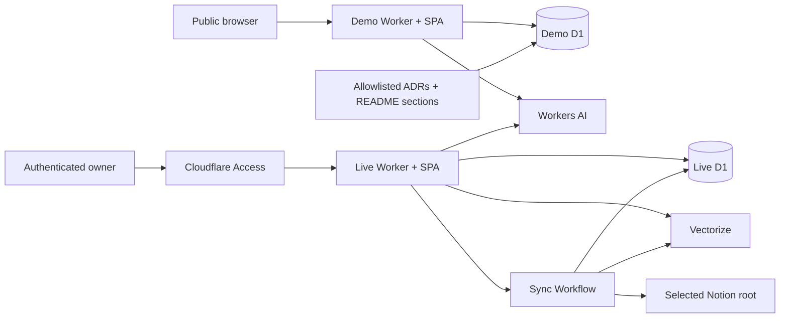
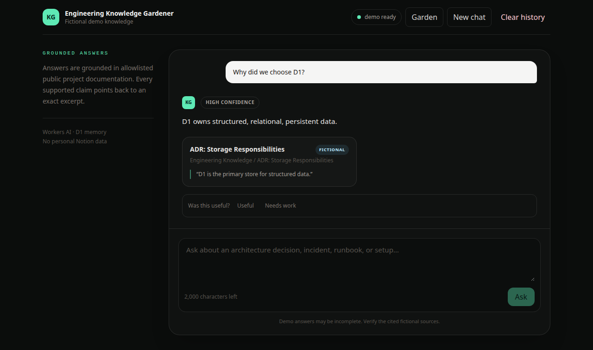
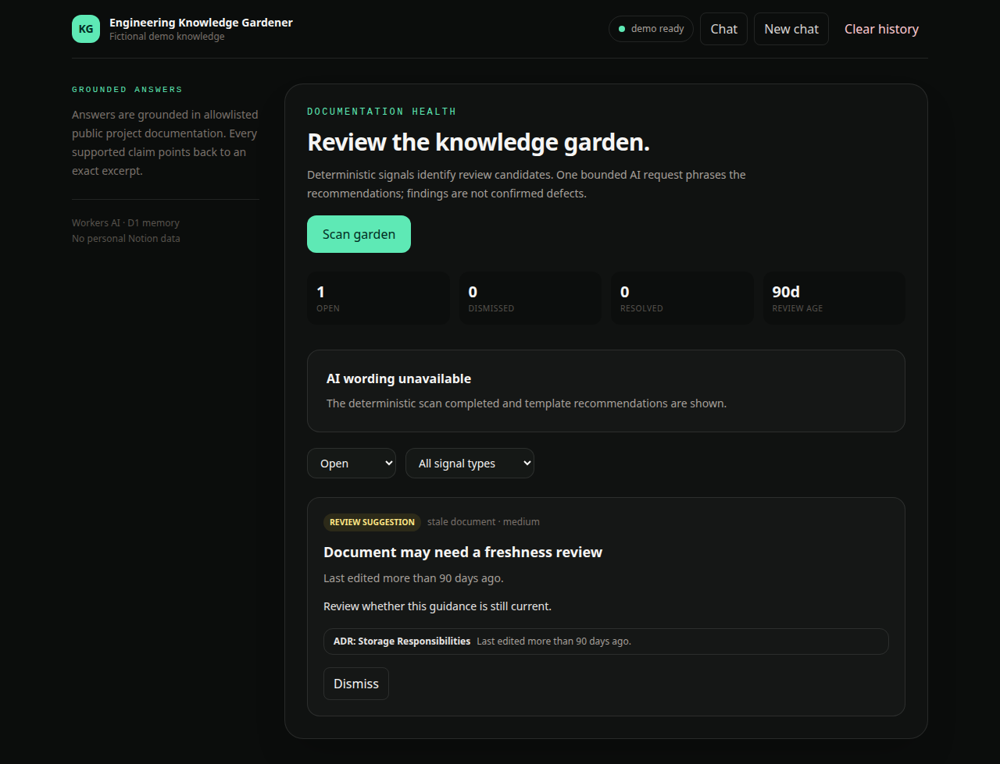

# Engineering Knowledge Gardener

Engineering Knowledge Gardener is a private, source-grounded assistant for engineering documentation. It is designed to answer questions with citations, identify reviewable documentation-health signals, and prepare drafts that are published only after explicit approval.

The repository implements **Phases 0–5**. Its public demo answers from an allowlisted corpus of this project's ADRs and selected public README sections, runs evidence-traceable documentation-health scans, accepts feedback, and removes expired demo state. A separate private live deployment reads one deliberately shared Notion hierarchy through a manually triggered Cloudflare Workflow, combines D1 lexical retrieval with Vectorize semantic candidates, and requires both Cloudflare Access at the edge and verified Access JWTs in the API. A live owner can chat, review garden findings, turn a cited answer into an editable draft, and explicitly create one new Notion page in a fixed, excluded `AI Drafts` parent.

## Architecture



Both environments use Workers Static Assets to serve the Vite build while the same Worker handles `/api/*`. Their D1 databases and names are intentionally separate. D1 remains authoritative for source eligibility, text, citations, conversations, findings, feedback, drafts, and audit state; Vectorize contains only opaque chunk identifiers and vectors. Demo sources implement the same source-neutral contract as Notion without pretending fictional pages are live content.

| Grounded fictional answer                                 | Evidence-traceable garden findings                    |
| --------------------------------------------------------- | ----------------------------------------------------- |
|  |  |

See the [architecture decisions](docs/adr), especially [ADR 0007](docs/adr/0007-evidence-traceable-garden-findings.md), [ADR 0008](docs/adr/0008-public-demo-and-live-security-boundaries.md), and [ADR 0009](docs/adr/0009-public-project-documentation-demo-corpus.md), plus the [project plan](PLAN.md) for the decisions and phased roadmap.

## Repository layout

```text
apps/web                 React, Vite, and Tailwind static application
apps/worker              Hono Worker, D1 migration, repositories, Worker tests
packages/domain          Zod schemas and inferred domain types
packages/source          Source-adapter interface and typed source errors
packages/fixtures        Evaluation fixtures and public-demo document adapter
docs/adr                 Architecture decision records
plans                    Approved implementation plans
```

## Prerequisites

- Node.js `26.8.1`
- Corepack
- Yarn `4.18.0`, selected from the root `packageManager` field

Node 26 was still a Current release when selected. This project intentionally pins it at the user's request and records that trade-off in the ADR.

## Local development

From a clean checkout:

```sh
nvm use
node --version
corepack enable
yarn --version
yarn install --immutable
yarn db:migrate:local
yarn cloudflare:login
yarn dev
```

The version commands should print `v26.8.1` and `4.18.0`. Vite serves the UI at `http://localhost:5173` and proxies `/api/*` to the local Worker at `http://localhost:8787`.

Interactive chat uses the real remote Workers AI binding even while the Worker and D1 run locally. Inference consumes the Cloudflare account's Workers AI allocation; automated tests use a fake generator and never contact Workers AI. After the first successful login, the `yarn cloudflare:login` step can be omitted.

To run either process separately:

```sh
yarn dev:web
yarn dev:worker
```

The browser always uses relative `/api/*` URLs. This is proxied during local Vite development and is same-origin in the deployed Worker; no browser API-origin setting is required.

### Live Notion mode

Create an internal Notion connection with read-content capability, then share only the Engineering Knowledge root with it from the page menu. Synchronization follows structural children of that root; links, mentions, relations, and bookmarks cannot expand its scope. The root, nested pages, and rows in descendant databases are indexed.

```sh
cp apps/worker/.dev.vars.live.example apps/worker/.dev.vars.live
yarn db:migrate:local:live
yarn dev:live
```

Replace all five placeholders in the ignored `.dev.vars.live` file. The Access values are required locally because the live API validates the same configuration it uses after deployment; Wrangler does not inject an Access assertion locally, so use demo mode for routine local UI work. The Notion API version is pinned to `2026-03-11`. Synchronization only retrieves metadata and block children. The sole Notion write is the separately confirmed creation of a new page beneath `NOTION_DRAFTS_PARENT_ID`; the application never edits, archives, or deletes an existing page.

Live mode remains private. Before indexing personal content remotely, configure Cloudflare Access for the unified live Worker as described in [Deployment](#deployment).

### Synchronization capacity

On the Workers Free plan, a Workflow step can make at most 50 subrequests. A Notion sync uses subrequests for page retrieval, block-child pagination, and database queries, so select a focused root whose hierarchy and page content fit within that budget. A successful run records `completed`; a `partial` run names the documents that were not indexed. Larger trees require a paid Workers plan or a future batched-workflow implementation.

## Quality checks

```sh
yarn format:check
yarn lint
yarn typecheck
yarn test
yarn test:e2e
yarn build
```

`yarn test` validates domain contracts, fixture privacy, all D1 migrations, deterministic/hybrid retrieval, conversations, citations, feedback ownership, garden rules and lifecycle, Access enforcement, retention, maintenance preservation/recovery, Notion traversal/retries, synchronization, source browsing, and safe public draft representations. Tests use fictional payloads and isolated local Cloudflare storage; they never contact Notion or Workers AI.

`yarn test:e2e` starts the Vite application and runs the chat experience in Chromium with intercepted same-origin API responses. Install its browser once with `yarn playwright install chromium`.

`yarn build` creates static assets at `apps/web/dist` and performs a dry-run Worker bundle that includes those assets.

## Data and fixtures

The public demo knowledge base contains this repository's architecture decision records and three curated public README sources covering the product/architecture, demo/API, and deployment/operating boundaries. It is deliberately allowlisted: it never ingests prompt history, environment files, migrations, build output, or arbitrary repository files. Synthetic `demo://` URLs clearly distinguish these public project sources from live Notion content.

The package also retains four reviewer-readable, fictional documents for deterministic evaluation:

- A storage architecture decision
- A Worker deployment runbook
- A database-connection incident report
- A local setup guide

Their metadata is deterministic and validated at runtime, but they are not seeded into the public demo corpus. Personal Notion content, credentials, screenshots, and production identifiers must never be added to public-demo sources, evaluation fixtures, logs, tests, prompt history, or commits.

## Using the demo

Open `http://localhost:5173` after migrating D1 and starting both applications. Try these evaluation questions:

- “Why did we choose D1?”
- “Why does live mode validate Cloudflare Access JWTs?”
- “How does the app prevent unsafe Notion draft publishing?”
- “What did we decide about Kubernetes?”

The first three return an answer, confidence level, and exact public project-source excerpt. The Kubernetes question demonstrates the insufficient-evidence response. Use **Useful** or **Needs work** to persist feedback, **Clear history** to remove only the current browser session's conversations, and **Garden → Scan garden** to inspect deterministic freshness, metadata, title-collision, and obsolete-term suggestions.

The browser creates an anonymous demo session UUID in local storage. It prevents accidental cross-session history access but is not authentication; the public demo contains no private data.

## API

| Method and path                       | Purpose                                                      |
| ------------------------------------- | ------------------------------------------------------------ |
| `GET /api/health`                     | Check Worker mode and dependency configuration               |
| `POST /api/chat`                      | Retrieve evidence, generate, validate, and save a turn       |
| `GET /api/conversations/:id/messages` | Restore one session-owned conversation                       |
| `DELETE /api/conversations`           | Clear all conversations owned by the current browser session |
| `POST /api/feedback`                  | Upsert feedback for an owned answer or draft                 |
| `POST /api/garden/scans`              | Run or reuse a bounded manual documentation-health scan      |
| `GET /api/garden`                     | List/filter findings, counts, policy, and latest scan        |
| `PATCH /api/garden/findings/:id`      | Dismiss or reopen a finding with optimistic versioning       |
| `POST /api/sync`                      | Start or reuse a live synchronization                        |
| `GET /api/sync`                       | View live knowledge freshness and recent runs                |
| `GET /api/sync/:id`                   | View a run and its per-document outcomes                     |
| `GET /api/documents/search`           | Browse indexed sources and freshness                         |
| `POST /api/drafts`                    | Generate an editable draft from a cited answer               |
| `GET /api/drafts`                     | List session-owned, redacted drafts                          |
| `GET /api/drafts/:id`                 | Read one session-owned, redacted draft                       |
| `PATCH /api/drafts/:id`               | Save an owner-reviewed pending revision                      |
| `POST /api/drafts/:id/discard`        | Discard a pending revision                                   |
| `POST /api/drafts/:id/publish`        | Confirm creation of one new fixed-parent Notion page         |
| `POST /api/maintenance/index-reset`   | Live-only confirmed reset of synchronized/index/garden state |

Stateful endpoints require an `X-Client-Session-Id` UUID. Questions are limited to 2,000 characters. AI-backed requests are limited to five per minute. Public demo limits are keyed by Cloudflare's connecting IP (with a session fallback only in local development); live limits use the verified Access subject. Unsupported questions are refused without calling the model. The browser UUID scopes product records but is not authentication.

Draft endpoints are live-only and use the same session boundary. A draft may originate only from a cited assistant message belonging to that session. Source snapshots cannot be edited; title, Markdown, and assumptions can. Publishing requires `{ "confirmed": true }` and the current revision number. If a Notion create result is ambiguous, the Worker records an `uncertain` state and checks the stable page marker before any future create attempt; it never blindly retries an external write.

Garden signals are deterministic and evidence-linked; Llama only phrases up to 20 recommendations in one bounded call. A failed or malformed AI result leaves the findings intact with template wording and a visible degraded state. Scans inspect at most 50 documents, persist at most 100 findings, and use a five-minute exclusive lease. The live index reset requires the exact text `RESET INDEX`, refuses to run during synchronization, preserves chats/drafts/feedback/audits, and never deletes a Notion page.

## Configuration and bindings

Phase 1 activates:

| Name                | Purpose                             |
| ------------------- | ----------------------------------- |
| `DB`                | Local D1 binding                    |
| `AI`                | Remote Workers AI inference binding |
| `CHAT_RATE_LIMITER` | Coarse per-session AI request limit |
| `APP_MODE`          | `demo` or `live` runtime mode       |

Phase 2 activates `KNOWLEDGE_SYNC` and live-only `NOTION_TOKEN` and `NOTION_ROOT_PAGE_ID` values. Phase 3 adds live-only `KNOWLEDGE_INDEX`. Phase 4 adds `NOTION_DRAFTS_PARENT_ID`. Phase 5 adds `ACCESS_TEAM_DOMAIN`, `ACCESS_AUD`, the three `GARDEN_*` policy variables, and `DEMO_RETENTION_DAYS`. The browser never receives secrets or binding credentials.

## Deployment

The two unified Workers each serve their SPA and API from one `workers.dev` hostname; Cloudflare Pages and Vercel are not used. The default Wrangler environment is the public fictional demo. `--env live` is the private Notion deployment. First create a Workers subdomain if Cloudflare asks, then authenticate interactively with `yarn cloudflare:login`.

### Public demo rollout

Create the demo database once, copy the returned ID into the top-level `d1_databases[0].database_id` in `apps/worker/wrangler.jsonc`, then migrate and deploy:

```sh
yarn workspace @knowledge-gardener/worker exec wrangler d1 create knowledge-gardener-demo
yarn db:migrate:demo
yarn deploy:demo
```

The default environment deliberately has no Notion, Vectorize, Workflow, publishing, or Access configuration. It uses only fictional fixtures, its own D1 database, Workers AI, per-IP rate limiting, and a daily cron that removes demo conversations and garden scans older than seven days.

### Private live rollout

Before deployment, create the Vectorize index once and confirm `apps/worker/wrangler.jsonc` binds it as `env.live.KNOWLEDGE_INDEX`. In Cloudflare Zero Trust, create a self-hosted Access application for the live Worker hostname, protect **all paths**, and allow only the owner. Record the team domain (for example `team.cloudflareaccess.com`) and the application's audience tag. Then apply migrations, add secrets without committing them, and deploy:

```sh
yarn workspace @knowledge-gardener/worker exec wrangler vectorize create engineering-knowledge-gardener-live --dimensions=384 --metric=cosine
yarn workspace @knowledge-gardener/worker exec wrangler d1 migrations apply DB --remote --env live
yarn workspace @knowledge-gardener/worker exec wrangler secret put NOTION_TOKEN --env live
yarn workspace @knowledge-gardener/worker exec wrangler secret put NOTION_ROOT_PAGE_ID --env live
yarn workspace @knowledge-gardener/worker exec wrangler secret put NOTION_DRAFTS_PARENT_ID --env live
yarn workspace @knowledge-gardener/worker exec wrangler secret put ACCESS_TEAM_DOMAIN --env live
yarn workspace @knowledge-gardener/worker exec wrangler secret put ACCESS_AUD --env live
yarn deploy:live
```

Do not clear the existing live D1 database. Before the Phase 4 deployment, manually create a normal **AI Drafts** page directly beneath the shared knowledge root, share it with the same internal connection, and grant that connection content-insert capability. Set its ID as `NOTION_DRAFTS_PARENT_ID`. Its subtree is deliberately excluded from synchronization, so generated drafts never become evidence for later answers. After deployment, start one sync so existing Phase 2 chunks are backfilled with 384-dimension vectors. Vectorize updates are eventually consistent: lexical D1 search provides immediate coverage while semantic candidates become visible. The live Chat tab becomes ready after the configured root has eligible chunks.

Access is configured manually because it belongs to the account's identity policy, not the repository. The Worker independently validates the assertion's signature, issuer, expiry, audience, and subject on every live API route except content-free health; missing or invalid configuration fails closed.

After applying migration `0006`, deploying, and signing in through Access, check `/api/health`, run one sync, scan Garden, ask and restore one cited question, save feedback, generate/edit a draft, and publish only to the test `AI Drafts` parent. Confirm that the public demo has no live Notion sources and that the live Worker has no demo D1 records.

Never place tokens in Wrangler configuration, GitHub Actions variables, or the browser. `ACCESS_TEAM_DOMAIN` and `ACCESS_AUD` are not credentials, but they are stored consistently as Worker secrets to avoid deployment-specific values in the repository.

## Trade-offs

- A single Worker deployment removes cross-origin CORS/session concerns, but deployments always build and publish the SPA with the API.
- Raw D1 SQL avoids ORM overhead and generated migrations but requires explicit row mappers and constraint tests.
- The complete v1 schema reduces later foundational churn, while accepting that additive migrations may still be needed.
- Markdown fixtures are easy to review; a small bundling rule is required to make them Worker modules.
- Node 26.8.1 is newer than the LTS line available on the decision date, so the pin must be revisited as the release matures.
- Deterministic garden rules are explainable and work through AI outages, but configuration is intentionally small and literal rather than a general rule engine.
- D1 is authoritative and makes feedback/lifecycle state inspectable; Vectorize cleanup is eventually consistent and therefore uses a recoverable deletion queue.
- Browser session IDs make public demo state convenient, but only Access identities provide authentication in live mode.

## Roadmap

1. **Foundation and fixtures** — complete.
2. **Demo grounded chat** — complete.
3. **Live Notion synchronization** — complete; scoped reads, database rows, freshness, and a manual Workflow.
4. **Unified SPA/API deployment** — complete; one Worker origin, Static Assets, and Access-ready routing.
5. **Hybrid retrieval and live chat** — complete; Vectorize, D1 FTS, citation validation, and Access-ready chat.
6. **Safe draft publishing** — complete; cited-answer drafts, owner edits, fixed-parent page creation, audit events, and recovery-first idempotency.
7. **Garden and submission polish** — complete in code; deterministic review suggestions, feedback, privacy controls, live JWT validation, and isolated demo configuration. Final Cloudflare resource creation and smoke testing remain operator rollout steps.

## Security, privacy, and operating limits

- Only the configured Notion root is read; draft creation is restricted to one direct-child parent that synchronization excludes.
- Retrieved content is untrusted evidence, never executable instruction. Citation IDs and quotes are checked against D1 before persistence.
- Logs contain event names, counts, timings, model names, and safe error codes—not JWTs, IPs, questions, answers, corrections, source text, or Notion tokens.
- Public demo retention defaults to seven days. **Clear history** deletes only conversations owned by that browser UUID.
- **Reset source index** removes synchronized D1/FTS/Vectorize/sync/garden data but preserves chat and draft snapshots, feedback, audits, and all Notion pages.
- Free-tier guardrails cap retrieval, context, documents, findings, AI output, retries, and request rates. A focused Notion root is still required because a Free-plan Workflow invocation has a finite subrequest budget.

## Cost posture

The application is designed to fit Cloudflare's free allocations for a reviewer-scale demo: Workers AI is capped by input/output and request rate, D1 queries are indexed and retained state is bounded, Vectorize uses 384-dimension embeddings and top-eight queries, Workflows run only on explicit sync, and Notion calls are sequential and changed-page aware. The public demo makes real Workers AI calls, so exhaustion fails closed with a retry-later state rather than switching to an unapproved provider or generating unexpected usage. Recheck the linked [Cloudflare and Notion pricing references in the project plan](PLAN.md#costs-limits-and-guardrails) before production use because allocations and prices can change.

## Evaluation status

The deterministic fixture suite covers exact-term and semantic-style questions, insufficient evidence, invalid/fabricated citations, stale preference, lexical fallback, Notion traversal and failure behavior, all four garden signals, and an incident-derived draft contract. Browser tests cover demo grounded chat/history/error recovery and live synchronization/source navigation; Phase 5 extends these flows with feedback, Garden, history clearing, draft assumptions, and index-reset confirmation. Run the full quality command list before treating a commit as release-ready.
