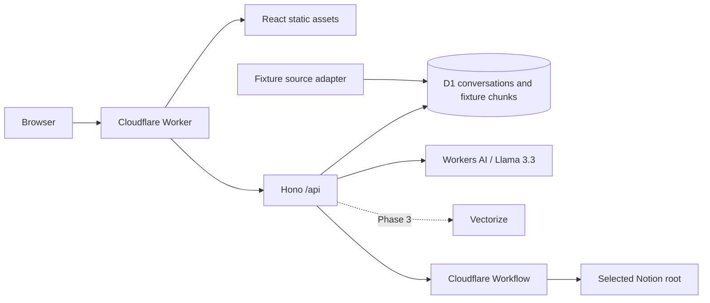

# Engineering Knowledge Gardener

Engineering Knowledge Gardener is a private, source-grounded assistant for engineering documentation. It is designed to answer questions with citations, identify reviewable documentation-health signals, and prepare drafts that are published only after explicit approval.

The repository currently implements **Phase 2-a**. The public-safe demo retains its grounded fixture chat, while private live mode can read a deliberately shared Notion hierarchy through a manually triggered Cloudflare Workflow. Live synchronization includes nested pages and database rows, stores normalized chunks and freshness in D1, and never writes to Notion. One Cloudflare Worker serves both the React SPA and its `/api` endpoints from one origin. Vectorize, live chat, and draft publishing remain later phases.

## Architecture



Cloudflare Workers Static Assets serves the Vite build while the same Worker handles `/api/*`. Shared domain schemas and source contracts keep the browser/API interface explicit. Demo sources use the same adapter shape planned for Notion, while source-neutral identifiers avoid pretending fictional pages are Notion pages.

See [ADR 0001](docs/adr/0001-foundation-architecture.md), [ADR 0002](docs/adr/0002-grounded-demo-chat-architecture.md), [ADR 0003](docs/adr/0003-live-notion-workflow-sync.md), [ADR 0004](docs/adr/0004-unified-worker-static-assets.md), and [the project plan](PLAN.md) for the decisions and phased roadmap.

## Repository layout

```text
apps/web                 React, Vite, and Tailwind static application
apps/worker              Hono Worker, D1 migration, repositories, Worker tests
packages/domain          Zod schemas and inferred domain types
packages/source          Source-adapter interface and typed source errors
packages/fixtures        Fictional Markdown sources and demo adapter
docs/adr                 Architecture decision records
plans                    Approved implementation plans
```

## Prerequisites

- Node.js `26.8.1`
- Corepack
- Yarn `4.18.0`, selected from the root `packageManager` field

Node 26 was still a Current release when selected. This project intentionally pins it at the user's request and records that trade-off in the ADR.

## Local development

From a clean checkout:

```sh
nvm use
node --version
corepack enable
yarn --version
yarn install --immutable
yarn db:migrate:local
yarn cloudflare:login
yarn dev
```

The version commands should print `v26.8.1` and `4.18.0`. Vite serves the UI at `http://localhost:5173` and proxies `/api/*` to the local Worker at `http://localhost:8787`.

Interactive chat uses the real remote Workers AI binding even while the Worker and D1 run locally. Inference consumes the Cloudflare account's Workers AI allocation; automated tests use a fake generator and never contact Workers AI. After the first successful login, the `yarn cloudflare:login` step can be omitted.

To run either process separately:

```sh
yarn dev:web
yarn dev:worker
```

The browser always uses relative `/api/*` URLs. This is proxied during local Vite development and is same-origin in the deployed Worker; no browser API-origin setting is required.

### Live Notion mode

Create an internal Notion connection with read-content capability, then share only the Engineering Knowledge root with it from the page menu. Synchronization follows structural children of that root; links, mentions, relations, and bookmarks cannot expand its scope. The root, nested pages, and rows in descendant databases are indexed.

```sh
cp apps/worker/.dev.vars.live.example apps/worker/.dev.vars.live
yarn db:migrate:local:live
yarn dev:live
```

Replace both placeholders in the ignored `.dev.vars.live` file. The Notion API version is pinned to `2026-03-11`. Live mode only retrieves metadata and block children; it never creates, updates, archives, or deletes a Notion resource.

Live mode remains private. Before indexing personal content remotely, configure Cloudflare Access for the unified live Worker as described in [Deployment](#deployment).

### Synchronization capacity

On the Workers Free plan, a Workflow step can make at most 50 subrequests. A Notion sync uses subrequests for page retrieval, block-child pagination, and database queries, so select a focused root whose hierarchy and page content fit within that budget. A successful run records `completed`; a `partial` run names the documents that were not indexed. Larger trees require a paid Workers plan or a future batched-workflow implementation.

## Quality checks

```sh
yarn format:check
yarn lint
yarn typecheck
yarn test
yarn test:e2e
yarn build
```

`yarn test` validates domain contracts, fixture privacy, all D1 migrations, deterministic retrieval, conversations, citations, Notion traversal/retries, normalization/chunking, synchronization, source browsing, same-origin API routing, and dependency failures. Tests use fictional payloads and isolated local Cloudflare storage; they never contact Notion or Workers AI.

`yarn test:e2e` starts the Vite application and runs the chat experience in Chromium with intercepted same-origin API responses. Install its browser once with `yarn playwright install chromium`.

`yarn build` creates static assets at `apps/web/dist` and performs a dry-run Worker bundle that includes those assets.

## Data and fixtures

The demo includes four reviewer-readable, fictional documents:

- A storage architecture decision
- A Worker deployment runbook
- A database-connection incident report
- A local setup guide

Their metadata is deterministic and validated at runtime. Synthetic `demo://` URLs clearly distinguish them from live sources. Personal Notion content, credentials, screenshots, and production identifiers must never be added to fixtures, logs, tests, prompt history, or commits.

## Using the demo

Open `http://localhost:5173` after migrating D1 and starting both applications. Try these evaluation questions:

- “Why did we choose D1?”
- “How was the connection incident mitigated?”
- “How do I run this project locally?”
- “What did we decide about Kubernetes?”

The first three return an answer, confidence level, and exact fictional source excerpt. The Kubernetes question demonstrates the insufficient-evidence response. One active conversation is restored from D1 after refresh; **New chat** starts a separate conversation without deleting the earlier record.

The browser creates an anonymous demo session UUID in local storage. It prevents accidental cross-session history access but is not authentication; the public demo contains no private data.

## API

| Method and path                       | Purpose                                              |
| ------------------------------------- | ---------------------------------------------------- |
| `GET /api/health`                     | Check Worker mode and D1 readiness                   |
| `POST /api/chat`                      | Retrieve evidence, generate, validate, and save turn |
| `GET /api/conversations/:id/messages` | Restore the active session-owned conversation        |
| `POST /api/sync`                      | Start or reuse a live synchronization                |
| `GET /api/sync`                       | View live knowledge freshness and recent runs        |
| `GET /api/sync/:id`                   | View a run and its per-document outcomes             |
| `GET /api/documents/search`           | Browse indexed sources and freshness                 |

Chat endpoints require an `X-Demo-Session-Id` UUID. Questions are limited to 2,000 characters. AI-backed requests are limited to five per demo session per minute; unsupported questions are refused without calling the model.

## Configuration and future bindings

Phase 1 activates:

| Name                | Purpose                             |
| ------------------- | ----------------------------------- |
| `DB`                | Local D1 binding                    |
| `AI`                | Remote Workers AI inference binding |
| `CHAT_RATE_LIMITER` | Coarse per-session AI request limit |
| `APP_MODE`          | `demo` or `live` runtime mode       |

Phase 2 also activates `KNOWLEDGE_SYNC` and live-only `NOTION_TOKEN` and `NOTION_ROOT_PAGE_ID` values. The browser never receives them. Vectorize (`KNOWLEDGE_INDEX`) remains deferred.

## Deployment

The unified Worker serves the SPA and API from its `workers.dev` hostname; Cloudflare Pages and Vercel are not used. First create a Workers subdomain if Cloudflare asks, then authenticate interactively with `yarn cloudflare:login`.

Before deployment, confirm `apps/worker/wrangler.jsonc` binds `env.live.DB` to the existing `knowledge-gardener-live` D1 database. Apply migrations, add secrets without committing them, and deploy:

```sh
yarn workspace @knowledge-gardener/worker exec wrangler d1 migrations apply DB --remote --env live
yarn workspace @knowledge-gardener/worker exec wrangler secret put NOTION_TOKEN --env live
yarn workspace @knowledge-gardener/worker exec wrangler secret put NOTION_ROOT_PAGE_ID --env live
yarn deploy:live
```

Open the resulting Worker URL and check `/api/health`. When the SPA and API work, go to **Workers & Pages → engineering-knowledge-gardener-api-live → Access**, protect **All traffic**, and allow only the owner's Cloudflare account or chosen identity. Access is configured manually because it belongs to the account's Zero Trust policy, not the application repository. The same-origin deployment lets its browser session authenticate both navigation and `/api/*` calls.

## Trade-offs

- A single Worker deployment removes cross-origin CORS/session concerns, but deployments always build and publish the SPA with the API.
- Raw D1 SQL avoids ORM overhead and generated migrations but requires explicit row mappers and constraint tests.
- The complete v1 schema reduces later foundational churn, while accepting that additive migrations may still be needed.
- Markdown fixtures are easy to review; a small bundling rule is required to make them Worker modules.
- Node 26.8.1 is newer than the LTS line available on the decision date, so the pin must be revisited as the release matures.

## Roadmap

1. **Foundation and fixtures** — complete.
2. **Demo grounded chat** — complete.
3. **Live Notion synchronization** — complete; scoped reads, database rows, freshness, and a manual Workflow.
4. **Unified SPA/API deployment** — complete; one Worker origin, Static Assets, and Access-ready routing.
5. **Hybrid retrieval** — Vectorize, exact search, citation validation, and live chat.
6. **Safe draft publishing** — editable drafts, approval, fixed parent, and idempotency.
7. **Garden and submission polish** — review suggestions, feedback, and hardening.
